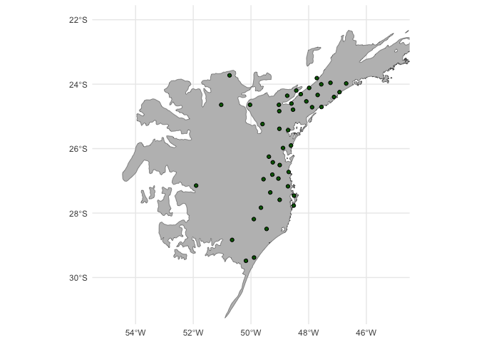

# Species Distribution Modeling of *Phyllomedusa distincta*


``` r
library(sf)
library(terra)
library(spThin)
library(janitor)
library(here)
library(rasterVis)
library(tidyverse)
library(patchwork)
library(usdm)
library(tidyterra)
library(rnaturalearth)
library(ENMeval)
```

# Current

## Variable selection

Bioclims:

I’m using CHELSA V2.1 CMIP6 Bioclims at 30 arc-seconds resolution,
aggregated to 5 arc-minutes Karger et al. (2017). **Downloaded on
2024-04-27.**

For projecting to past climates, I’m using [CHELSA TraCE21k v1.0
Bioclims](https://cp.copernicus.org/preprints/cp-2021-30/cp-2021-30.pdf)
at 1000-year intervals back to the LGM. 30 arc-seconds resolution,
aggregated to 5 arc-minutes Karger et al. (2023). **Download on
2024-04-27.**

## Variable processing

First, I’m reading in the localities and plotting them to make sure
there isn’t anything wild. Everything looks reasonable!

``` r
locs_sf <- read_csv(here("distincta_localities.csv")) %>%
  st_as_sf(coords = c("longitude", "latitude"),
           crs = 4326,
           remove = FALSE)

# atlantic forest shapefile for plotting
af <- read_sf(here("climate", "atlantic_forest.geojson")) %>% 
  terra::vect() %>% 
  terra::aggregate() %>% 
  st_as_sf()

# plot
ggplot() +
  geom_sf(data = st_geometry(af), fill = "gray") +
  geom_sf(data = locs_sf, shape = 21, fill = "darkgreen") +
  coord_sf(xlim = c(-55, -45), ylim = c(-31, -22)) +
  theme_minimal()
```


Creating a convex hull with an 2 degree buffer.

``` r
mcp_all <- st_convex_hull(st_union(locs_sf)) %>%
  st_buffer(dist = units::set_units(2, degree)) 

ggplot() +
  geom_sf(data = af, fill = "gray") +
  geom_sf(data = mcp_all, fill = "transparent") +
  geom_sf(data = locs_sf, shape = 21, fill = "darkgreen") +
  coord_sf(xlim = c(-55, -45), ylim = c(-31, -22)) +
  theme_minimal()
```


Read in bioclims.

``` r
land <- rnaturalearth::ne_countries(scale = "large", continent = "South America") %>%
  vect() %>% 
  terra::project("epsg:4326")

bioclims <- terra::rast(list.files(here("climate"), pattern = "_0kyBP.tif", full.names = TRUE)) %>% 
  terra::project("epsg:4326") %>% 
  # crop the bioclims to the coastline
  crop(land) %>% 
  mask(land)

# get the only the bioclim labels
names(bioclims) <- str_extract(names(bioclims), "bio[\\d+]*")

ggplot() +
  geom_spatraster(data = bioclims$bio1) +
  scale_fill_whitebox_c("muted") +
  geom_sf(data = af, fill = "transparent") +
  geom_sf(data = mcp_all, fill = "transparent") +
  geom_sf(data = locs_sf, shape = 21, fill = "darkgreen") +
  coord_sf(xlim = c(-55, -45), ylim = c(-31, -22)) +
  labs(fill = "Average\nAnnual Temp. (C°)") +
  theme_minimal()
```


## General SDM steps

I’m going to perform the following steps:

- spatially thin localities  
- extract background environmental data (10,000 points max) for
  predictor correlation and modeling
- remove predictors w/ high variance inflation factor (10)
- Use Maxent for modeling
  - L, LQ, H, LQH feature classes
  - regularization multipliers from 0.5 to 5.0 in 0.5 increments to test
    a wide range of regularization
  - spatial cross validation (block) for model selection
  - select models first by AICc (model fit), followed by ommission error
    rate (prediction)

#### Spatial thin

Spatial thin. I’m using a 20 km buffer to reduce the impact of spatial
autocorrelation.

``` r
set.seed(39434)

#run spthin algorithm. This returns 100 possible combinations of removed localities
output <-
  spThin::thin(
    locs_sf,
    'latitude',
    'longitude',
    'species',
    thin.par = 20,
    reps = 100,
    locs.thinned.list.return = TRUE,
    write.files = FALSE,
    write.log.file = FALSE,
    verbose = FALSE
  )

# I want to maximize the # of localities returned  
maxThin <- which(sapply(output, nrow) == max(sapply(output, nrow)))

# if there are multiple iterations with the max # of localities, pick one
maxThin <-
  output[[ifelse(length(maxThin) > 1, maxThin[1], maxThin)]]

# subset locs to match only thinned locs
locs_sf <- locs_sf[as.numeric(rownames(maxThin)), ]

# get the unused locs as a testing data set
# this probably isn't useful since they will overlap heavily with the training data, but seems like another piece of info to look at
test <- locs_sf[-as.numeric(rownames(maxThin)), ]

ggplot() + 
  geom_sf(data = af, fill = "gray") + 
  geom_sf(data = locs_sf, shape = 21, fill = "darkgreen") +
  coord_sf(xlim = c(-55, -45), ylim = c(-31, -22)) +
  theme_minimal()
```



Write thinned locs to file.

``` r
st_write(locs_sf, here("distincta_thinned.geojson"))
```

#### Predictor VIF

Sample 10000 background points. Only returned 7247 points.

``` r
set.seed(1938)

# for variable correlations
bg_envt <- terra::spatSample(bioclims, 10000, 
                               warn=TRUE, 
                               na.rm = TRUE, 
                               as.df = TRUE,
                               xy = TRUE)

# for use in ENMevaluate
bg_coords <- bg_envt[,c("x", "y")]
```

Next, I’ll extract the values for the background points and perform
variance inflation factor stepwise selection with a VIF threshold of 10.

``` r
# extract values
bg_corr <- bg_envt %>% select(-x, -y)

usdm::vifstep(bg_corr, th=10)
```

    12 variables from the 19 input variables have collinearity problem: 
     
    bio6 bio11 bio10 bio7 bio16 bio1 bio17 bio12 bio3 bio15 bio14 bio18 

    After excluding the collinear variables, the linear correlation coefficients ranges between: 
    min correlation ( bio9 ~ bio4 ):  -0.02275026 
    max correlation ( bio4 ~ bio19 ):  0.7765465 

    ---------- VIFs of the remained variables -------- 
      Variables      VIF
    1     bio13 1.826101
    2     bio19 3.566431
    3      bio2 1.783369
    4      bio4 7.040131
    5      bio5 6.290903
    6      bio8 5.894234
    7      bio9 3.375079

The final variable list: BIO2, BIO4, BIO5, BIO8, BIO9, BIO13, BIO19

``` r
# label: pred

predictors <- bioclims[[c("bio2", "bio4", "bio5", "bio8", "bio9", "bio13", "bio19")]]
```

#### Maxent model

I’m using a spatial cross-validation (block) evaluation approach to
reduce the impact of spatial autocorrelation on inference. Following
Radosavljevic and Anderson (2014).

``` r
set.seed(70787)
coords <- st_coordinates(locs_sf)
colnames(coords) <- c("x", "y")

folds <- ENMeval::get.block(occs = coords, bg = bg_coords, orientation = "lon_lat")
```

Plot the folds assignments of localities.

``` r
locs_folds <- locs_sf %>% 
  mutate(fold = as.factor(folds$occs.grp))

ggplot() +
  geom_sf(data = af, fill = "gray") +
  geom_sf(data = locs_folds, aes(fill = fold), shape = 21) +
  scale_fill_viridis_d() +
  coord_sf(xlim = c(-55, -45), ylim = c(-31, -22)) +
  theme_minimal()
```


Run the model. Predictions are clamped to prevent extrapolation.

``` r
set.seed(34223)

# the vector of regularization multipliers to test
rms <- seq(0.5, 5, 0.5)

# convert the terra object to a raster stack for use in EMNeval
predictors_stack <- raster::stack(predictors)

# iterate model building over all chosen parameter settings
sdm <-
  ENMeval::ENMevaluate(
    occs = coords,
    envs = predictors_stack,
    bg = bg_coords,
    tune.args = list(fc = c("L", "LQ", "H", "LQH"), rm = rms),
    partitions = "user",
    algorithm = "maxent.jar",
    # clamping to prevent model extrapolation
    doClamp = TRUE,
    user.grp = folds,
    taxon.name = "distincta",
    n.bg = 10000,
    parallel = TRUE,
    numCores = 6
  )
```

``` r
# write the model to file
write_rds(sdm, here("output", "sdm.rds"))
```

##### Model evaluation

Let’s take a look at the model results.

``` r
eval_table <- sdm@results
eval_mods <- sdm@models

names(eval_mods) <-
  str_replace_all(names(eval_mods), "\\.", "\\_")
```

Select the final model. I’m going to take a look at tables of delta
AICc, omission rate, and AUC to see how close the models are.

Four models are within 2 AICc of each other. I selected the model with
LQ feature class and a regularization multiplier of 2 because this is
the simplest model out of the three (6 coefficients), contains the
lowest omission rate (both 10th percentile and MTP), and has the highest
AUC performance on the validation set.

``` r
eval_table %>% 
  select(delta.AICc, AICc, or.10p.avg, or.mtp.avg, auc.diff.avg, auc.val.avg, rm, fc, ncoef) %>%
  arrange(delta.AICc) %>% 
  head(10) %>% 
  knitr::kable()
```

| delta.AICc |     AICc | or.10p.avg | or.mtp.avg | auc.diff.avg | auc.val.avg | rm  | fc  | ncoef |
|-----------:|---------:|-----------:|-----------:|-------------:|------------:|:----|:----|------:|
|  0.0000000 | 741.5708 |  0.1325758 |  0.0000000 |    0.0837627 |   0.8383768 | 3.5 | H   |    10 |
|  0.2132967 | 741.7841 |  0.2121212 |  0.0416667 |    0.0970246 |   0.8203831 | 0.5 | LQ  |     9 |
|  0.2802014 | 741.8511 |  0.1325758 |  0.0000000 |    0.0778545 |   0.8430579 | 2.5 | H   |    12 |
|  1.1781577 | 742.7490 |  0.1306818 |  0.0000000 |    0.0843780 |   0.8606543 | 2   | LQ  |     6 |
|  2.1385630 | 743.7094 |  0.1306818 |  0.0000000 |    0.0849645 |   0.8613279 | 2.5 | LQ  |     6 |
|  3.1354431 | 744.7063 |  0.1306818 |  0.0000000 |    0.0845692 |   0.8590986 | 1.5 | LQ  |     7 |
|  3.2699481 | 744.8408 |  0.1306818 |  0.0000000 |    0.0847962 |   0.8613106 | 3   | LQ  |     6 |
|  3.7849764 | 745.3558 |  0.1325758 |  0.0000000 |    0.0868614 |   0.8359246 | 4   | H   |    10 |
|  4.1170809 | 745.6879 |  0.1306818 |  0.0208333 |    0.0871230 |   0.8511904 | 1   | LQ  |     8 |
|  4.5667797 | 746.1376 |  0.1306818 |  0.0000000 |    0.0857743 |   0.8596454 | 3.5 | LQ  |     6 |

Select model.

``` r
mod <- eval_mods$fc_LQ_rm_2
opt_seq_tune <- "fc.LQ_rm.2"
```

Plot the variable contributions and response curves. The most important
variables are bio2, bio13, and bio9. All precipitation!

``` r
plot(mod)
```


Suitability increases with precipitation amount of the wettest month,
decreases with precipitation seasonality, and increases with mean
monthly precipitation of the warmest quarter.

``` r
dismo::response(mod)
```


##### Project

I’m projecting the model to the study area extent.

``` r
pred <- ENMeval::eval.predictions(sdm)[[opt_seq_tune]] %>% 
  rast()


ggplot() +
  geom_spatraster(data = pred) +
  scale_fill_whitebox_c("muted") +
  geom_sf(data = af, fill = "transparent") +
  geom_sf(data = locs_sf, fill = "darkgreen", shape = 21) +
  coord_sf(xlim = c(-55, -45), ylim = c(-31, -22)) +
  theme_minimal()
```


``` r
pred_thresh <- pred[[opt_seq_tune]]
# observed suitabilities
obs_suit <- terra::extract(pred_thresh, locs_sf)
# minimum training presence
min_suit <- min(obs_suit)

pred_thresh[pred_thresh >= min_suit] <- 1
pred_thresh[pred_thresh < min_suit] <- 0

ggplot() +
  geom_spatraster(data = pred_thresh) +
  scale_fill_whitebox_c("muted") +
  geom_sf(data = af, fill = "transparent") +
  geom_sf(data = locs_sf, fill = "darkgreen", shape = 21) +
  coord_sf(xlim = c(-55, -45), ylim = c(-31, -22)) +
  theme_minimal()
```


## References

<div class="refs">

</div>

<div id="refs" class="references csl-bib-body hanging-indent"
entry-spacing="0">

<div id="ref-karger2017" class="csl-entry">

Karger, Dirk Nikolaus, Olaf Conrad, Jürgen Böhner, Tobias Kawohl, Holger
Kreft, Rodrigo Wilber Soria-Auza, Niklaus E. Zimmermann, H. Peter
Linder, and Michael Kessler. 2017. “Climatologies at High Resolution for
the Earth’s Land Surface Areas.” *Scientific Data* 4 (September):
170122. <https://doi.org/10.1038/sdata.2017.122>.

</div>

<div id="ref-karger2023" class="csl-entry">

Karger, Dirk Nikolaus, Michael P. Nobis, Signe Normand, Catherine H.
Graham, and Niklaus E. Zimmermann. 2023. “CHELSA-TraCE21k
High-Resolution (1 Km) Downscaled Transient Temperature and
Precipitation Data Since the Last Glacial Maximum.” *Climate of the
Past* 19 (2): 439–56. <https://doi.org/10.5194/cp-19-439-2023>.

</div>

<div id="ref-radosavljevic2014" class="csl-entry">

Radosavljevic, Aleksandar, and Robert P. Anderson. 2014. “Making Better
Maxent Models of Species Distributions: Complexity, Overfitting and
Evaluation.” *Journal of Biogeography* 41 (4): 629–43.
<https://doi.org/10.1111/jbi.12227>.

</div>

</div>
